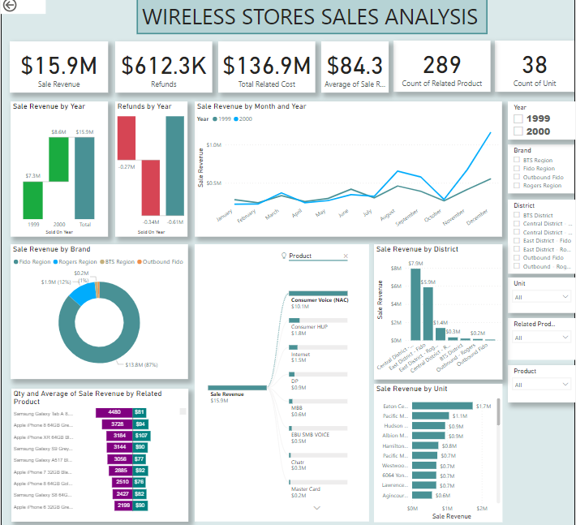

# WirelessDNA

### DataSet

Dummy Sales Data.xlsx

### Objective

Utilize the given data and create visualizations, presentations and establish an executive summary.

### Deliverables 

The text below is copied verbatim from the email

- [] Please analyse Sales and comparison by Unit, District and Brand at product level and over the course of timelines to evaluate growth and opportunities based on trends.
- [] We have attached 2 sets of data HDW Sales and Service Products Sale, both are related to each other however, there is no margin on HDW and it is sold as a product with service (Voice, HUP and MBB services) prepare analysis to reflect investment and margin requirements and evaluate sales HDW turnover. You may prepare comparison at organization, Region, District and Unit level to share insights and comparability.
- [] Prepare dashboard with multiple metrics relevant to the data set based on your understanding of the data and your expertise to help management understand the levers better and drive decisions based on your insights.
- [] Make the dashboard dynamic so that it can be drilled down to individual unit as well as can be seen at organization level.
- [] Prepare an executive presentation, story telling of the data with insights. Also share how you evaluated the data and what other sources you will like to see to drive better reporting.

### Summary of Analysis

At wirelessDNA, Fido sales dominate the market-share against Rogers with over 7 to 1 ratio. Although the related cost of the contracts can be tracked and forecasted on a timesheet, Revenue for wirelessDNA is contingent on HDW (hardware) sales and other services such as internet, prepaid, mastercard, MBB, SMB and voice plans. The sales of HDW can be broken down into different levels such as brand, district, unit and devices and further categorized by how much revenue they generate and how often they have the risk of being returned or refunded.

This data is available in excel (Dummy Sales Data.xlsx) format. Two tables were provided in two sheets HDW sales and Service Products. 

The dashboard is created in powerbi.

Observation
•	Refunded sales were adding to total of related cost. Transformed the data set to be more accurate
•	Date was in decimal format
•	There were few blank rows of data which I removed for more accurate results
•	Fido is $130 cheaper than Rogers

Opportunity
•	Mitigation of refunds. For all the sales performed. 3.7% are being refunded or exchanged. 
•	Small business plans have a higher ROI. We should take time to train staff on presenting business options to industry professional who might have their own registered business i.e. accountant, contractors, lawyers, plumbers, electricians etc
•	Multiple lines/add a line
•	Utilizing high profit devices such as iphone SE, older blackberry devices/clearance devices
